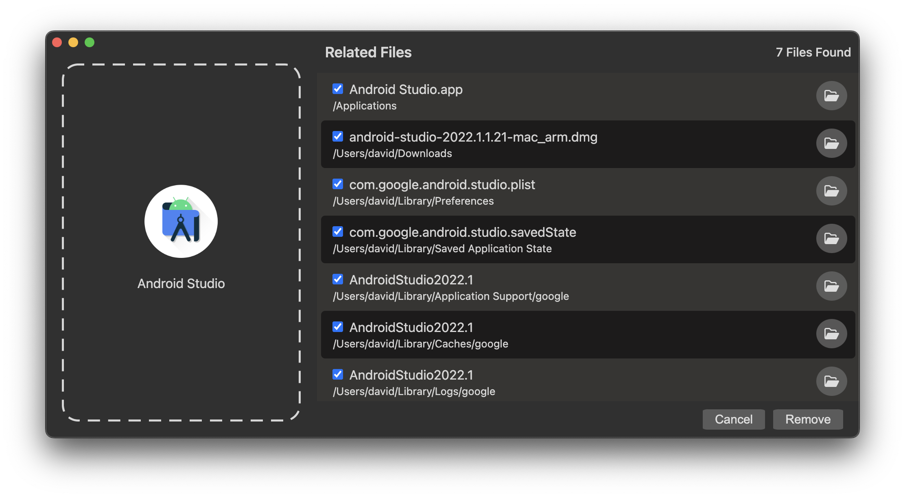

<h1 align="center">App Eraser - macOS App Removal Tool</h1>

[ProductHunt](https://www.producthunt.com/posts/app-eraser)
| [AlternativeTo](https://alternativeto.net/software/app-eraser/about/)

App Eraser helps remove unwanted macOS applications and any related files that they leave behind.

## ⬇ Install
You can download the latest version from the [releases page](https://github.com/davunt/app-eraser/releases).

### Installation Issues
'App Eraser can't be opened because it is from an unidentified developer'
1. In the Finder on your Mac, locate the 'App Eraser' app in 'Applications' folder. (Not Launchpad)
2. Control-click the app icon, then choose Open from the shortcut menu.

### Permissions
App Eraser requires some permissions in order to find and move files to trash.
If you feel App Eraser is not correctly working please take a look at the settings below:
1. Go to `System Preferences` > `Security and Privacy` > `Privacy`
2. Enable the following permissions:
 * Enable `Finder` access in the `Automation`section. This allows App Eraser to move files to trash
* Enable the folders you want to allow App Eraser to search in `Files and Folders`

## 🤷 Why?
When deleting apps in macOS, many related files are left behind, taking up space on your hard drive. App Eraser helps to find these files and provides a quick and easy way to delete them.

Similar tools exist, however I believe an open source version is perfect for ensuring constant improvement and user privacy.

I’ve used similar tools in the past and have had issues related to some files remaining after the app has been deleted. I think an open source tool will allow for the community to work together to create a better app removal tool.

Another reason is the inherit privacy benefits that come from open source software. I don’t believe such a simple app should require any analytics or store any data about the usage of the software. I have open sourced the app to allow others to have peace of mind when using it.

## 🕵️ How it works
* App Eraser gets the name and bundle ID for the app you select to remove
* Next, App Eraser will look at files across multiple directories on your computer
* Each file is checked to see if they contain the app name or bundle ID, and how much of the file name is made up of these patterns
* To ensure a more accurate comparison, common patterns (such as dates, UUIDs and file extensions) are not considered.
* Only files with a score greater than the threshold are deemed to be related to the app

## 👩‍💻 Development
The app is created using [Electron.js](https://www.electronjs.org/), HTML, CSS and JavaScript. If you wish to run from source you can simply clone this repository and follow the information below.

### Requirements
- [nodejs](https://nodejs.org/en/)
- [volta](https://volta.sh/) - for pinning of node version

### Scripts
NPM Scripts:

- `npm start` - run the electron app
- `npm run lint` - run eslint across all .js files
- `npm run build` - packages application as a .dmg
- `npm run test` - run unit tests

### Project Structure
`app.js` - the entry file for the application

`assets` - all styling configuration (CSS) and images used in the application

`src` - all application views and logic 

`utils` - functions or constants used across the application

#### ESLint
ESLint is used to analyze code to find issues and to enforce coding style. The ESLint config can be found in `.eslintrc.js`.